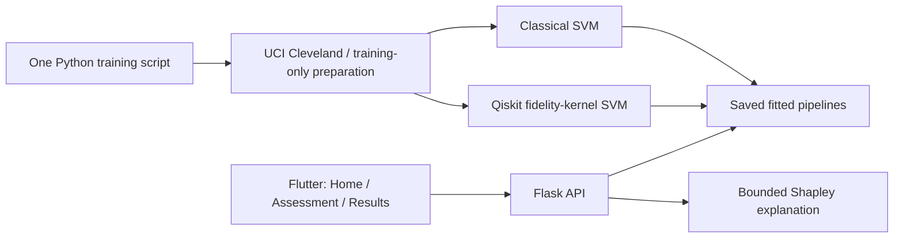

# Hybrid Quantum Machine Learning Platform for Early Disease Detection

A small **student research prototype** built with Flutter and Flask. It supports one disease (heart disease), one classical SVM and one genuine Qiskit quantum-kernel SVM. No database, worker, cloud account or quantum hardware is required.

The title describes the project goal. The demonstration performs classification on a historical diagnostic benchmark; it does **not** prove early detection or estimate future disease risk.

## Local setup and run

Use **Python 3.12** and **Flutter 3.41 or newer**. From the repository root in PowerShell:

```powershell
python --version
# Confirm this is Python 3.12 before creating the environment.
python -m venv .venv
.\.venv\Scripts\python -m pip install -r backend/requirements-dev.txt
.\.venv\Scripts\python backend/train_model.py
.\.venv\Scripts\python backend/app.py
```

In a second terminal:

```powershell
flutter pub get
flutter run -d chrome --web-port 8080 --dart-define=API_BASE_URL=http://localhost:5000
```

**This existing Windows workspace already has the verified Python 3.12 environment at `.venv312`.** Use these exact commands here instead of recreating it:

```powershell
.\.venv312\Scripts\python backend/train_model.py
.\.venv312\Scripts\python backend/app.py
```

The original `.venv` uses Python 3.14 and encountered a Windows application-control DLL error. Use `.venv312` here, or Python 3.12 for a clean setup.

Training reads the included, checksummed public Cleveland CSV. If absent, the script downloads it from UCI through `fetch_heart.py`. To explicitly refresh the public dataset:

```powershell
.\.venv312\Scripts\python backend/fetch_heart.py
```

For Android emulators set `API_BASE_URL=http://10.0.2.2:5000`; release deployments should use HTTPS. Browser requests use the exact allowed origin `http://localhost:8080`. Override `CORS_ORIGINS` if you use another origin. The API binds to localhost by default.

## The three-screen demonstration

1. **Home:** short introduction and **Start Assessment**.
2. **Assessment:** four labeled measurements; **Load Sample**, **Import CSV**, downloadable **CSV template**, and **Analyze**. The sample and template contain a real held-out benchmark record. CSV import accepts exactly one record with the saved model's four feature names. No names or personal identifiers are collected.
3. **Results:** quantum model classification, a clearly labeled model score, three actual model influences, an expandable classical/quantum comparison, and **Download PDF**.

Blank measurements use the training medians. At least one measurement is required; nonnumeric, negative and nonfinite inputs are rejected. A sample is recommended for demonstration because exercise-test measurements should not be guessed.

## Data and labels

Source: [UCI Heart Disease](https://archive.ics.uci.edu/dataset/45/heart+disease), Cleveland subset. Citation: Janosi et al. (1989), DOI `10.24432/C52P4X`, CC BY 4.0. There are 303 records and 13 documented original predictors. Target `num=0` maps to disease absent; `num=1,2,3,4` maps to disease present (angiographic disease status). Original category codes and missing-value conventions (`?`) are preserved during loading.

The source archive, extracted file and normalized CSV checksums are stored in `backend/benchmarks/heart.manifest.json`. Training verifies the normalized checksum. Identifiers are excluded.

Training-only ANOVA selects four of the five continuous predictors. The current selected inputs are:

| CSV field | Display label | Meaning |
|---|---|---|
| `age` | Age | Age in years at the recorded examination |
| `trestbps` | Resting blood pressure | Resting systolic blood pressure on hospital admission, mmHg |
| `thalach` | Maximum exercise heart rate | Maximum heart rate achieved during exercise, bpm; not resting heart rate |
| `oldpeak` | ST depression during exercise | Exercise-induced ST depression relative to rest; use the recorded ECG value |

The form and CSV template read these fields from the trained artifact rather than assuming a universal health form.

## Two models, one fair initial comparison

One script, `backend/train_model.py`, trains both models:

- Classical RBF-kernel SVM, C=1.
- Quantum fidelity-kernel SVM, C=1. Qiskit simulates a four-qubit circuit using two repetitions of H, RY(x), RZ(x squared), and a linear CNOT chain. Squared state overlaps form a kernel for a classical SVM optimizer. This is real quantum circuit simulation; it is not a classical prediction relabeled as quantum.

The fixed stratified split uses seed 42: **181 training, 61 validation and 61 test records**. Missing-value imputation, feature selection and scaling are fitted exclusively on training rows. Both models receive the same four selected features, transformed identically into [0, pi], and use identical split indices. Thresholds are chosen using validation balanced accuracy, then evaluated once on the held-out test set. Hyperparameters are fixed; no tuning on test data or post-selection refit occurs.

Fitted pipelines, the fitted selector, background records, sample, schema, comparison and provenance are saved together under `backend/artifacts/heart-prototype/`. A versioned bundle and atomic `latest.json` pointer ensure failed retraining does not replace the last working model. The API loads only these locally generated artifacts. Do not load untrusted joblib/pickle files.

## Actual measured results

Measured locally on 24 September 2026. The held-out set contains 28 positive and 33 negative records.

| Model | Accuracy | Sensitivity | Specificity |
|---|---:|---:|---:|
| Classical SVM | 88.5% | 85.7% | 90.9% |
| Quantum-kernel SVM | 78.7% | 71.4% | 84.8% |

The classical model performs better on this split. Improved quantum performance is an open hypothesis, not an established result. Exact metrics, confusion matrices, fitted thresholds, split indices, environment and circuit resources are in `docs/heart-benchmark.json`.

## Explanation and honest output

Predictions use the quantum model. Its raw decision margin and validation-selected boundary are displayed, **not a probability or percentage risk**. Probability is null because calibration has not been performed.

Four features make a small exact Shapley calculation practical: enumerate all 16 coalitions over eight training-only reference records (128 pipeline evaluations). This produces exact interventional Shapley values for that empirical reference distribution. The baseline plus all four contributions reconstructs the model score; the interface displays the three largest absolute contributions. These explain model behavior, not biological causes. The reference distribution and ignored feature dependence remain limitations.

The PDF includes the result, measurements, top influences, comparison, threshold, model version, dataset checksum, source and limitations. It uses the existing Flutter `pdf`/`printing` reporting packages and a concise paginated layout.

## Minimal architecture and API



| Route | Purpose |
|---|---|
| `GET /health` | API health |
| `GET /api/config` | Trained input schema and measured comparison |
| `GET /api/sample` | Real held-out example |
| `GET /api/template` | Download one-record CSV template |
| `POST /api/import` | Validate CSV text and return measurements |
| `POST /api/analyze` | Classify and explain `{"features": {...}}` |

Local setup uses files only. Database connectivity and authentication are deliberately outside this demonstration's scope. Use public benchmark data. Old `/predict` and `/history` routes return an explicit retirement message; the old synthetic model files are removed, and earlier ignored experiment artifacts are not loaded. The multi-disease dashboard, registry, training queue, history controls and extra algorithms have been removed from the active code.

## Delivery Table (Expected Deliverables)

| Area | Delivered | Evidence |
|---|---|---|
| Data preparation | Real UCI Cleveland data, documented labels, checksum validation and training-only preprocessing | Dataset manifest, fitted selector/pipelines, recorded split indices |
| Hybrid architecture | Flutter + Flask + locally saved artifacts; no database needed | Working sample-to-result API and UI flow |
| Quantum model | Four-qubit Qiskit fidelity kernel with SVM; same-input classical baseline | Saved circuit configuration and measured comparison |
| Predictions | Honest model score, exact bounded Shapley values and three understandable influences | Additivity/reload tests and result screen |
| Working prototype | Three screens, sample loading, single-row CSV import/template and PDF download | Flutter interaction tests, API integration tests and report layout check |

## Verification

```powershell
.\.venv312\Scripts\python -m pytest backend/tests -q
flutter test
flutter analyze
flutter build web --dart-define=API_BASE_URL=http://localhost:5000
```

The PDF regression test generates `build/test-reports/heart-assessment.pdf` from `test/fixtures/heart_result.json`, which is an actual saved benchmark prediction rather than an invented response. Build outputs and fitted binary artifacts are gitignored.

## Limitations

- Small historical diagnostic dataset and one fixed split; no independent clinical or early-screening validation, repeated-seed study or calibrated risk probability.
- Exact, noiseless CPU simulation only; no QPU execution, speedup or quantum advantage claim.
- Only four continuous features; useful for a student demonstration, not a replacement for a complete clinical assessment.
- No patient identity, user accounts, database requirement or production security layer. Public benchmark demonstration only.
- Render configuration is optional and has not been deployed. Native mobile/macOS builds have not been verified.
